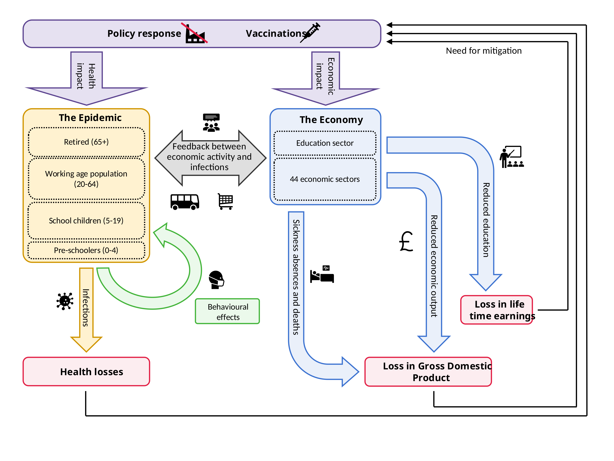

```{r settings, echo = FALSE}
knitr::opts_chunk$set(
  echo = FALSE,
  dpi = 300,
  collapse = TRUE,
  message = FALSE,
  warning = FALSE,
  out.width = "70%",
  fig.pos = "H"
)
```

```{r setup}
library(daedalus)
library(daedalus.compare)
library(daedalus.workshop)

library(ggplot2)
library(ggdist)

library(dplyr)
library(tidyr)
library(purrr)
```

```{r path_params}
# TODO: move into calling function? should this overwrite file?
figs_out <- fs::path_abs("figures")
if (!dir.exists(figs_out)) {
  fs::dir_create(figs_out)
}

tables_out <- fs::path_abs("tables")
if (!dir.exists(tables_out)) {
  fs::dir_create(tables_out)
}
```

```{r params}
country <- daedalus_country("{{ country }}")

disease <- "{{ disease }}"
infection <- daedalus_infection(disease) # to align with daedalus() arg names

currency <- "{{ currency }}"

n_samples <- {{ n_samples }}

t0 <- {{ t0 }}
horizon <- {{ horizon }}
final_horizon <- {{ final_horizon }}
t_diff <- horizon - t0
```

```{r inject-explainer, child="rmdchunks/explainer.Rmd", echo=FALSE}
```

```{r inject-projections, child="rmdchunks/projections.Rmd", echo=FALSE}
```

# Explanation of the exercise

You are a government advisor in **{{ country }}**.
There is a global pandemic, and on day zero the first case is detected in {{ country }}; see **figure \@ref(fig:plot-explainer-01)**.

On **day {{ t0 }}**, every table needs to make a decision:

- Should we implement closures? 
- Should we close businesses, while leaving schools open?
- Or close both businesses and schools? Shall we implement this now, or on any day over the next **{{ t_diff }}** days?
- You can choose from among several strategies, ranging in stringency (**see table \@ref(tbl:mitigation)**).

The Imperial team presents you with projections of the health and economic outcomes of different strategies for the next {{ t_diff }} days.
They use Imperial’s DAEDALUS model for the projections.
Before the coffee break, your table needs to commit to one strategy, and note it down on the response strategy form. 

There is considerable uncertainty surrounding the outcomes from each strategy; see **figure \@ref(fig:plot-explainer-02)**. 

After the coffee break, every table needs to briefly explain their chosen strategy.
Our senior decision makers choose the strategy they want to implement.  

On **Day {{ horizon }}**, the Imperial team presents the outcomes from the chosen strategy, projecting outcomes for the next `r {{ final_horizon }} - {{ horizon }}` days; see **figure \@ref(fig:plot-explainer-03)**.
The team also presents outcomes for one alternative strategy. 

The workshop concludes with a discussion of the choices and the use of modelling in making tough trade-offs during early outbreaks.

```{r plot-explainer-01}
#| fig.cap: "Timeline of the initial phase of this exercise. Participants
#| are at day {{ t0 }} (red dashed line), after the first reported case.
#| Epidemic outcomes, such as the number of daily detected cases shown here,
#| depend upon policy choices: mainly, the implementation of mitigation
#| strategies, including the time, duration, and stringency of implementation.
#| Projections for potential outcomes are shown until a horizon of {{ horizon }}
#| days (vertical grey dashed line)."

knitr::include_graphics(
  file.path(figs_out, "plot_explainer_01.png")
)
```

```{r plot-explainer-02}
#| fig.cap: "Uncertainty in projections in the initial phase of the exercise.
#| Participants will see multiple curves for each mitigation strategy. Curves
#| represent the range of possible outcomes for the epidemic. This uncertainty
#| is due to uncertainty in the infection parameters, such as the $R_0$.
#| A later figure explains how uncertainty is communicated in this handout."

knitr::include_graphics(
  file.path(figs_out, "plot_explainer_02.png")
)
```

```{r plot-explainer-03}
#| fig.cap: "Final phase of the exercise. Participants are at day {{ horizon }}
#| and will see epidemic outcomes under the chosen mitigation strategy until
#| {{ final_horizon }} days after the initial case, side-by-side with outcomes
#| for an unmitigated outbreak."

knitr::include_graphics(
  file.path(figs_out, "plot_explainer_03.png")
)
```

## The Daedalus Model

```{r schematic}

```

DAEDALUS models infection transmissions within the community, the economy, and during travel between these places.

The community consists of individuals who are not employed, workers during their leisure time and when working from home, school children and students during their leisure time and when attending school online.

The economy consists of workers in 45 economic sectors, including the education sector.

There is an exchange between the community and the economy, via workers travelling between home and workplaces, students and teachers traveling to educational institutions, and individuals consuming goods and services.

Transmission of infections in the community, at workplaces, in educational institutions, while consuming goods and services and travelling is modelled via a deterministic compartmental SEIR model.
This determines the number of infected individuals seeking hospital treatment.
Contact rates vary by age group and by economic sectors.

The government can implement partial closures of schools and/or of economic activity not essential to day-to-day life.
This reduces workplace infections because workers and/or students stay in the community and do not travel and spend time at workplaces, which has a dampening effect on infections.

However, closures reduce sectors’ economic production to the percentage they are closed; this results in a loss of economic output (measured by sectoral Gross Value Added, or GVA) and a reduction in short-term GDP in the aggregate, compared to pre-pandemic production.

Sickness absences and deaths of workers, teachers and students reduces economic output, proxied by the GVA of the sector per worker and days of sickness, and for deaths until the end of the projection (adjustments are made for sectors that are partially closed by government mitigation).

There is a circular loop, in that health, economic and education losses may instigate governments to implement or lift mitigation policies.
See the online dashboard, [Daedalus Explore](https://daedalus.jameel-institute.org/scenarios/new).

```{r plot-r0-dist}
#| fig.cap: "Distribution of $R_0$. The true $R_0$ cannot be known but is in the range
#| shown below. Higher bars above values indicate that those values are more
#| likely."

knitr::include_graphics(
  file.path(figs_out, "plot_dist_r0.png")
)
```

```{r plot-eta-dist}
#| fig.cap: "Distribution of the mean hospitalisation rate. The true
#| hospitalisation rate cannot be known, and may vary between age groups."

knitr::include_graphics(
  file.path(figs_out, "plot_dist_eta.png")
)
```

## Mitigation strategies

See table \@ref(tbl:sector-contacts) in this handout for more information on economic productivity and workplace contacts.

```{r inject-table, child="rmdchunks/table_mitigation.Rmd", echo=FALSE}
```

## Uncertainty in epidemic projections

We summarise newly detected cases by highlighting the median curve and shading the areas covering 50% and 95% of curves closest to the median.
These are the 50% and 95% projection intervals. 

```{r explainer-raw}
#| fig.cap: "Projected epidemic curves for each realised infection sample.
#| There is uncertainty around the true infection parameters, and these curves
#| show the range of possible outcomes given current information."

knitr::include_graphics(
  file.path(figs_out, "plot_unmit_daily_cases_explainer.png")
)
```

```{r explainer-shaded}
#| fig.cap: "Epidemic projection curves are covered by shaded regions, which
#| represent distance from the median curve. Curves farther away from the
#| median curve represent less likely outcomes."

knitr::include_graphics(
  file.path(figs_out, "plot_unmit_daily_cases.png")
)
```

# Epidemic projections under mitigation scenarios

## Projected epidemic outcomes for an unmitigated epidemic

```{r plot-unmit-daily-cases}
#| fig.cap: "Projections of daily new detected cases. Please consider that there
#| may be under-ascertainment, i.e., not all cases may be detected and there
#| may be more infections than detected cases."

knitr::include_graphics(
  file.path(figs_out, "plot_unmit_daily_cases.png")
)
```

```{r plot-unmit-daily-hosp}
#| fig.cap: "Projections of daily new hospital demand. Consider that there may
#| be under-ascertainment, i.e., not all infections requiring hospital care may
#| be detected. Hospital demand may be substantially greater
#| than actual hospital capacity."

knitr::include_graphics(
  file.path(figs_out, "plot_unmit_daily_hospitalisations.png")
)
```

```{r plot-unmit-total-hosp}
#| fig.cap: "Projections of total hospital demand. This may be interpreted as
#| hospital occupancy. Consider that there may be under-ascertainment, i.e., not
#| all infections requiring hospital care may be detected. Hospital demand may
#| be substantially greater than actual hospital capacity."

knitr::include_graphics(
  file.path(figs_out, "plot_unmit_total_hosp.png")
)
```

```{r plot-unmit-daily-deaths}
#| fig.cap: "Projections of daily deaths. Consider that there may be
#| under-ascertaintment and not all deaths may be detected."

knitr::include_graphics(
  file.path(figs_out, "plot_unmit_daily_deaths.png")
)
```

```{r plot-unmit-epi-summary}
#| fig.cap: "Projections of the cumulative numbers of detected cases and deaths
#| by day {{ horizon }}. Shaded regions show the
#| projection intervals."

knitr::include_graphics(
  file.path(figs_out, "plot_unmit_epi_summary.png")
)
```

```{r plot-unmit-deaths-age}
#| fig.cap: "Projections of the cumulative numbers of deaths by day
#| {{ horizon }} sub-divided by the age-group affected. Shaded regions show
#| projection intervals."

knitr::include_graphics(
  file.path(figs_out, "plot_unmit_deaths_by_age.png")
)
```

```{r plot-unmit-gva-loss}
#| fig.cap: "Cumulative economic losses by day {{ horizon }}."

knitr::include_graphics(
  file.path(figs_out, "plot_unmit_gva_loss.png")
)
```

## Projected epidemic outcomes for mitigation scenarios

```{r plot-scenarios-daily-cases}
#| fig.cap: "Projected daily new detected cases."
knitr::include_graphics(
  file.path(figs_out, "plot_compare_daily_cases_square.png")
)
```

```{r plot-scenarios-daily-hosp}
#| fig.cap: "Projected daily new hospital demand (admissions)."
knitr::include_graphics(
  file.path(figs_out, "plot_compare_daily_hospitalisations_square.png")
)
```

```{r plot-scenarios-total-hosp}
#| fig.cap: "Projected daily total hospital demand (occupancy)."
knitr::include_graphics(
  file.path(figs_out, "plot_compare_total_hosp_square.png")
)
```

```{r plot-scenarios-daily-deaths}
#| fig.cap: "Projected daily deaths."

knitr::include_graphics(
  file.path(figs_out, "plot_compare_daily_deaths_square.png")
)
```

```{r plot-scenarios-epi-summary}
#| fig.cap: "Projected cumulative detected cases and deaths by day
#| {{ horizon }}."

knitr::include_graphics(
  file.path(figs_out, "plot_compare_epi_summary.png")
)
```

```{r plot-scenarios-deaths-age}
#| fig.cap: "Projected cumulative detected deaths by day {{ horizon }} in each
#| age group."

knitr::include_graphics(
  file.path(figs_out, "plot_compare_deaths_by_age_square.png")
)
```

```{r plot-scenarios-gva-loss}
#| fig.cap: "Projected cumulative economic losses by day {{ horizon }}."

knitr::include_graphics(
  file.path(figs_out, "plot_compare_gva_loss_square.png")
)
```

# Additional decision-making aids

```{r sector-contacts}
make_sector_table(country, currency)
```

```{r risk_hosp_overflow}
make_hcap_breaches_table(tables_out)
```

## Median and limits of additional outcomes

```{r deaths_age_group}
make_deaths_by_age_table(tables_out)
```

```{r domain_specific_costs}
make_domain_costs_table(tables_out, currency)
```

```{r econ_costs_breakdown}
make_econ_cost_table(tables_out, currency)
```
